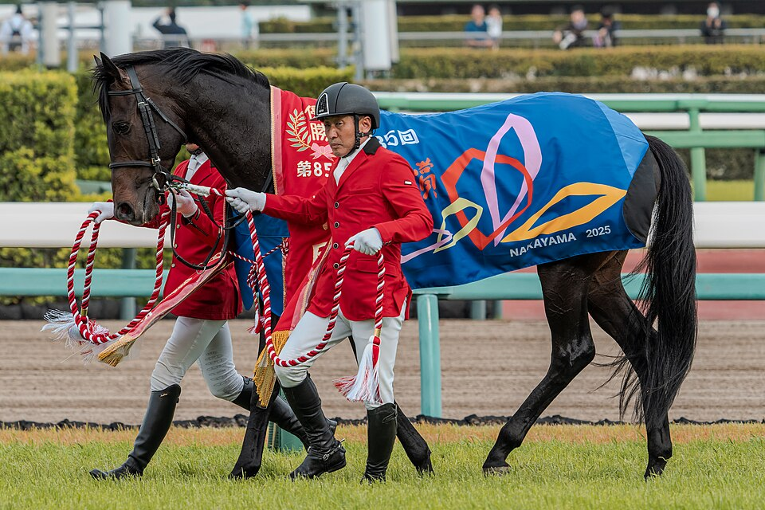
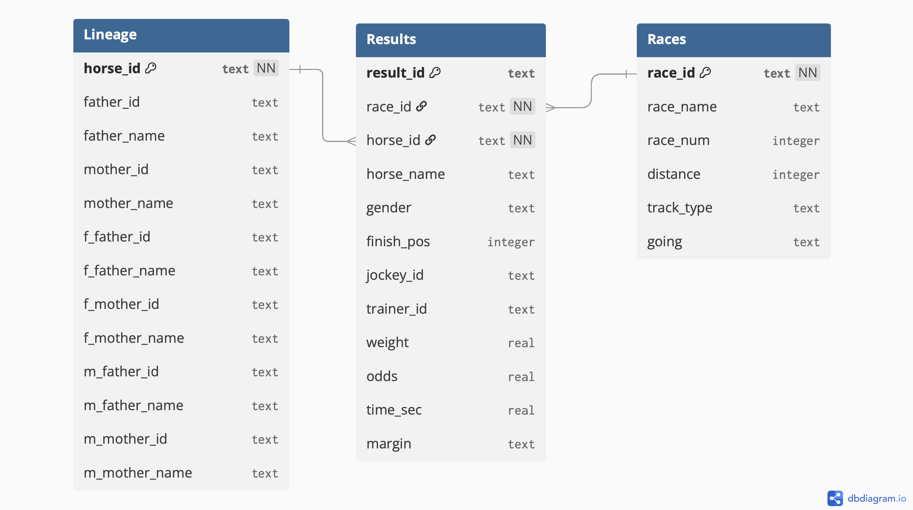

# EDS 213: Databases & Data Management - Final Project

<figure>
  
  <figcaption>Museum Mile after winning the 2025 Satsuki Sho.</figcaption>
</figure>

# About

This repository contains the final project materials for the course EDS 213 - Databases & Data Management at UCSB's Masters of Environmental Data Science. The project's main goal is to practice good database management and database querying to produce visualizations.

## Data Source

Data was scraped from [netkeiba](netkeiba.com), an official Japan horse racing website. This was done with a Python script that was ran in the background with a total scraping time of around 25 hours to complete. This resulted in a single output file: `keiba25.db`, a type of relational database containing five tables. More information can be found at my [Keiba Scrape Repository](https://github.com/zachyyy700/keiba-scrape-25).

## Contents

### Data

1. `keiba25.db`
    - Database file resulting from scraping script.

2. `data/raw`
    - Raw csv files, exported from `keiba25.db` in DB Browser for SQLite.

3. `data/processed`
    - Written csv files, after processing raw csvs in `clean.py`.

4. `horses.duckdb`
    - Main database used for analysis. Created by importing processed csvs into SQL tables and exporting to .duckdb file in `data_import.sql`.

#### Main Schema

### SQL

1. `data_import.sql`, create SQL table definitions, read csvs into SQL tables, save completed database into `horses.duckdb`.

2. `data_query.sql`, loads `horses.duckdb`, and runs initial test queries.

### Visualization

1. `visualize_R.qmd`, connects to duckdb database using `duckdb` SQL connection with `dbplyr` package and contains code for final visualizations. Plots were saved as a vector format (.pdf) to be loaded into Affinity designer for further processing.

2. `viz_output/`, folder containing `ggplot` visualization outputs.

### Reproducibility

Since both R and Python was used for this project, each of their respective requirements to reproduce this analysis was also included in this repository.

1. Python: `environment.yml`
2. R: `requirements.txt`

## Acknowledgements

- [keibascraper](https://github.com/new-village/KeibaScraper) by [@new-village](https://github.com/new-village) — licensed under the [Apache 2.0 License](https://www.apache.org/licenses/LICENSE-2.0).

## Author

Zach Loo
